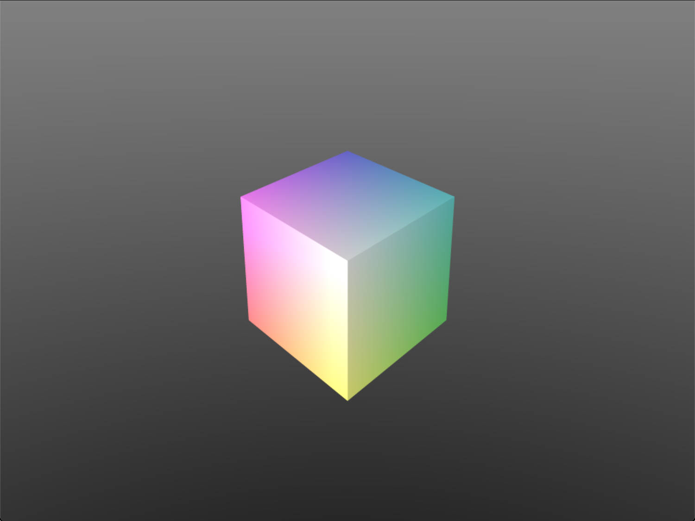

A modern cpp simple software rasterizer based on `easyx`(for reading and presenting img)
and `eigen3`(for matrix calculation).

## Prerequisite:
> visual studio 2022 
> eigen3 
> easyx 
> openmp

## Features:
 - [x] triangle
 - [x] skybox
 - [x] SSAA
 - [x] texture

## Result:

